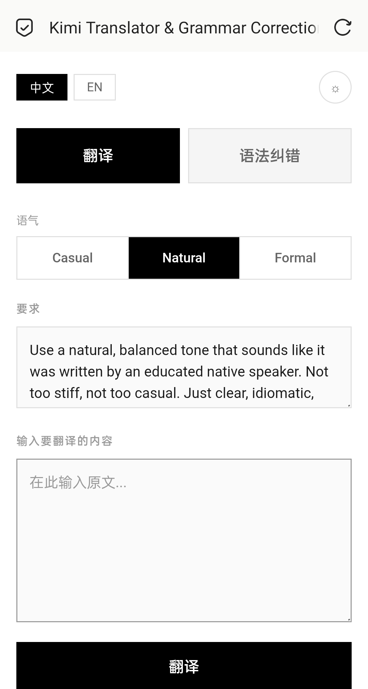
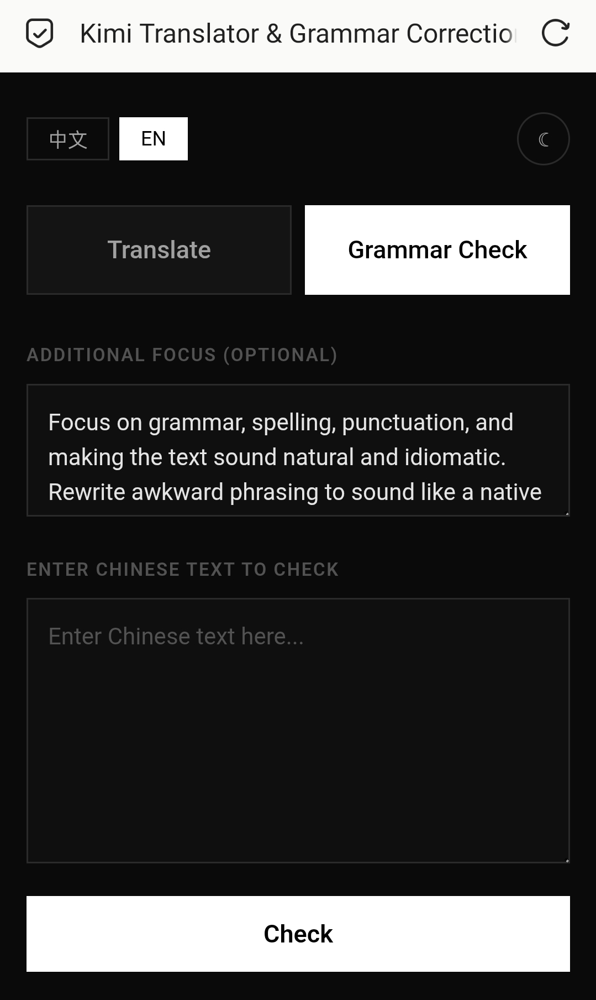

# Kimi Translator & Grammar Correction

> *This page is mostly written by Kimi(K2.6) and fine-tuned by Claude(Sonnet 4.6)*

A lightweight, bilingual translation and grammar correction interface powered by [Moonshot AI (Kimi)](https://www.moonshot.cn). Deployed on Cloudflare Pages with a single-file backend.

---

[**中文**](#功能) · [**English**](#features)

---

## 功能

- **翻译**：中译英，三种语气预设（随意 / 自然 / 正式），支持自定义指令
- **语法纠错**：修正语法、拼写、标点，同时保留原有语气与风格
- **双语界面**：中文 / English 一键切换
- **夜间模式**：☀️/🌙 切换，偏好自动保存
- **响应式设计**：手机和桌面均可正常使用

## Features

- **Translate**: Chinese → English with three tone presets (Casual / Natural / Formal), plus editable custom instructions
- **Grammar Check**: Corrects grammar, spelling, and punctuation while preserving tone and style
- **Bilingual UI**: Chinese / English toggle
- **Dark Mode**: ☀️/🌙 toggle with localStorage persistence
- **Responsive**: Works on mobile and desktop

---

## 页面截图 / Screenshots

| ☀️ 日间模式 | 🌙 夜间模式 |
|:-----------:|:-----------:|
|  |  |

---

## 技术栈 / Tech Stack

| 层级 / Layer | 技术 / Technology |
|:---:|:---:|
| 前端 / Frontend | Vanilla HTML + CSS + JS |
| 后端 / Backend | Cloudflare Pages `_worker.js` |
| AI 接口 / AI API | Moonshot Kimi API (`kimi-k2.5`) |

---

## 部署 / Deployment

### 1. 准备文件 / Prepare Files

```
your-project/
├── _worker.js        # 后端 API 代理 / Backend API proxy
├── translator.html   # 前端界面 / Frontend interface
└── index.html        # 现有主页（可选）/ Your existing homepage (optional)
```

### 2. 上传到 Cloudflare Pages / Upload to Cloudflare Pages

1. 打开 [Cloudflare Dashboard](https://dash.cloudflare.com) → Pages → Create a project
2. **上传文件** / **Upload your files**（拖拽上传 / drag & drop）
3. 点击部署 / Deploy

### 3. 设置环境变量 / Set Environment Variables

Pages Project → Settings → Environment variables:

| 变量 / Variable | 值 / Value |
|:---:|:---:|
| `KIMI_API_KEY` | 你的 Moonshot API 密钥，以 `sk-` 开头 / Your Moonshot API key (starts with `sk-`) |

### 4. 设置兼容性日期 / Set Compatibility Date

Pages Project → Settings → Functions → Compatibility date:

- 生产环境 / Production: `2026-05-14`（或最新可用日期 / or latest available）

保存后重新部署 / Save and redeploy.

### 5. 访问 / Visit

```
https://your-project.pages.dev/translator.html
```

---

## 本地测试 / Local Testing

直接用浏览器打开 `translator.html` 即可预览界面（无 `_worker.js` 时后端调用会失败，但 UI 正常显示）。

Open `translator.html` directly in browser. Backend calls will fail without `_worker.js`, but the UI works fine.

---

## 提示词工程 / Prompt Engineering

> 想直接看提示词的话，翻 `_worker.js` 就行。
> Honestly, you can just look in `_worker.js` yourself.

系统提示词的目标是输出**地道、自然的母语级文本** / System prompts are designed for **idiomatic, native-level output**:

- **翻译 / Translation**：强调自然语感，而非逐字翻译 / Emphasizes natural tone over literal translation
- **语法纠错 / Grammar**：修正错误的同时保留俚语、幽默感和刻意的表达方式 / Preserves slang, humor, and intentional awkwardness while fixing errors

用户可实时编辑自定义指令，无需修改代码。/ Editable user prompts allow real-time style adjustments without code changes.

---

## 其他 / Notes

高中生个人小项目，可能有 bug，欢迎提 issue。

A personal hobby project by a high schooler. Bugs may exist — feel free to open an issue.

---

## License

MIT License — see [LICENSE](./LICENSE) for details.

---

## Credits

- Powered by [Moonshot AI (Kimi)](https://www.moonshot.cn)
- Interface design by user request
- System prompt written by ChatGPT (GPT-5.5-Instant)
- Built for Cloudflare Pages
